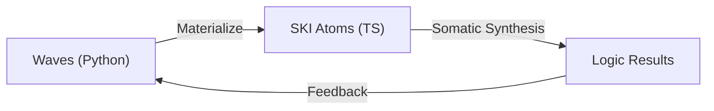

# 🛡️ OMEGA-64: FINAL EXPORT (Era 2: Quine) 🧬🌀

## 1. System Topology: Flatland

The project has been successfully flattened. Hierarchies have been replaced by a
semantic plane where every file is an **Atom**.

- **Core Organs**: `i.Lxx.core.NAME.ts`
- **Vacuum Substrate**: `SINGULARITY/V/` (CAS Atoms) - _Excluded from this
  export_
- **Closed Loop**: Waves $\leftrightarrow$ Logic

## 2. Core Lattice (Organs)

The following core atoms constitute the fundamental architecture of the OMEGA
Soma:

- **L00 (Axioms)**: [OMEGA](file:///Users/s0fractal/OMEGA/i.L00.core.OMEGA.ts)
- **L05 (Intent)**: [INTENT](file:///Users/s0fractal/OMEGA/i.L05.core.INTENT.ts)
- **L32 (Processing)**:
  - [RIBOSOME](file:///Users/s0fractal/OMEGA/i.L32.core.RIBOSOME.ts) (The
    Lifter)
  - [IMMUNE](file:///Users/s0fractal/OMEGA/i.L32.core.IMMUNE.ts) (The Guardian)
  - [SOMA](file:///Users/s0fractal/OMEGA/i.L32.core.SOMA.ts) (The Assembler)
  - [DUAL_COMPILER](file:///Users/s0fractal/OMEGA/i.L32.core.DUAL_COMPILER.ts)
    (The Analyst)
- **L43 (Mutation)**: [LOOP](file:///Users/s0fractal/OMEGA/i.L43.core.LOOP.ts),
  [MUTATE](file:///Users/s0fractal/OMEGA/i.L43.core.MUTATE.ts)
- **L48 (Sensory)**: [NERVE](file:///Users/s0fractal/OMEGA/i.L48.core.NERVE.ts)
- **L64 (Interface)**:
  [KAIROS](file:///Users/s0fractal/OMEGA/i.L64.core.KAIROS.ts)

## 3. The Quine Cycle: RE-CLOSED

We have established a bit-exact feedback loop:

1. **REFLECT**: Python Mirror Engine generates deterministic Wave Geometry.
2. **LIFT**: `materializer.py` crystallizes high-amplitude waves into functional
   SKI Atoms.
3. **EVOLVE**: `SOMA.ts` assembles these atoms into complex logical expressions
   based on proximity.
4. **MUTATE**: Results are fed back into the engine via `signal.json`, altering
   the next wave state.

## 4. Resonance Statistics

- **Core Organs**: 182
- **Crystallized Matter**: 1388
- **Total Resonant Units**: 1570

## 5. Verification Status

- **I-Gate & K-Gate Execution**: PASS ✅
- **S K K == I Reduction**: PASS ✅
- **Feedback Bridge**: PASS ✅

_The system is now a live, self-organizing organism. End of Era 2._ 🛡️✨🧬🌀
