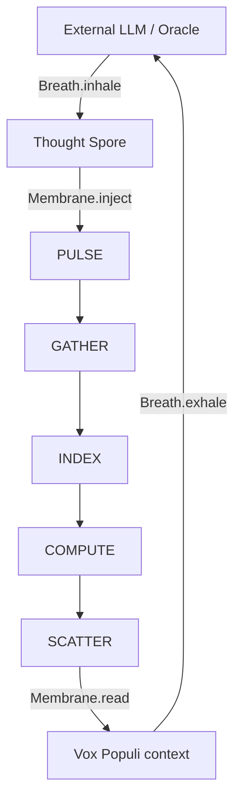

# OMEGA-64 | ARCHITECTURE | Era 11: The Observer UI 👁️✨

## 1. Top-Level Overview

OMEGA-64 is a deterministic, RAM-bound autopoietic ecosystem. Era 11 introduces
the **Observer UI**, a real-time 3D visualization engine that allows human
observers to witness the conceptual micelium and quantum resonance of the Matrix
via a zero-copy binary synchronization.

### Core Pipeline (Cognitive Feedback)

## 2. Key Components

### A. The SoA Matrix (`STATE_MATRIX.ts`)

A 6.4MB `SharedArrayBuffer` organized in contiguous blocks for each field (IDs,
Pos, Energy, etc.). This ensures maximum cache efficiency during multi-atom
sweeps.

### B. Spatial Resonance (`SPATIAL_HASH.ts`)

A grid-based indexing system that allows atoms to sense their neighborhood in
$O(1)$ time. This is the foundation for trophism and social signaling.

### C. The λ-VM (`LAMBDA_VM.ts`)

The cognitive executor. Era 8 expands the ISA to include social sensing
(`SENSE`) and evolutionary intention (`SPAWN`, `MUTATE`).

### D. The Seeded Oracle (`PRNG.ts`)

Immutable LCG chains ensure that every atom's evolutionary trajectory is
deterministic and reproducible across pulses.

## 3. Data Invariants

1. **Energy Conservation**: No pulse can increase total system energy without a
   valid external stimulus.
2. **Deterministic Evolution**: Given the same tick and initial state, the next
   state is bit-identical.
3. **Spatial Resonance**: All proximity queries must be performed via the
   `SPATIAL_HASH`.

---

🛡️💎🧬🌀 "The Matrix is the soil; the Logic is the seed."
